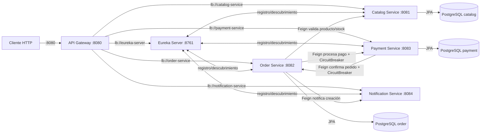

# Order System Microservices

Sistema de pedidos basado en microservicios construido con **Java 21 + Spring Boot 3.3**, presentado como portafolio técnico. Cada servicio es un proyecto Maven independiente dentro de un monorepo, comunicado entre sí mediante **Service Discovery (Eureka)**, **API Gateway**, **OpenFeign** y protegido con **Resilience4j Circuit Breaker**.

## Descripción y propósito

El proyecto simula un flujo de pedidos real:

1. El cliente envía un pedido al **api-gateway** (único punto de entrada).
2. **order-service** valida productos y stock consultando a **catalog-service**.
3. **order-service** procesa el pago llamando a **payment-service**, que persiste cada intento (aprobado o rechazado) con una **referencia única (hash SHA-256)** y falla en ~30% de los casos para demostrar resiliencia. Cuando el pago se aprueba, **payment-service confirma la orden** (la marca `PAGADO` con su `paymentReference`).
4. Si el pago falla, un **circuit breaker** degrada la respuesta marcando el pedido como `PAGO_PENDIENTE` en vez de devolver un error 500.
5. Los pedidos se pueden **listar y consultar** (`GET /api/orders`). Un pedido `PAGO_PENDIENTE` se paga llamando directamente a **payment-service** con su `orderId` y `amount` (`POST /payments/process`), el cual valida que la orden exista, no esté pagada y que el monto coincida exactamente con el total; al aprobarse, `payment-service` confirma la orden automáticamente. Los pagos se pueden auditar y listar de forma consolidada (`GET /payments`).
6. Una vez creado o confirmado, se notifica a **notification-service** (solo log).

Permite demostrar: registro/descubrimiento de servicios, balanceo de carga con `lb://`, resiliencia con circuit breaker, manejo global de errores con `ProblemDetail`, bases de datos segregadas y despliegue completo con Docker Compose.

## Diagrama de arquitectura



## Instrucciones de ejecución

### Requisitos previos

- Docker + Docker Compose (v2)
- Puerto libres: 8080, 8081, 8082, 8083, 8084, 8761, 5433, 5434, 5435

### Clonar y levantar

```bash
git clone https://github.com/Cheyernex/order-flow-microservices.git
cd order-system-microservices
docker compose up --build
```

La primera compilación puede tardar varios minutos (descarga de dependencias Maven e imágenes base). Los Dockerfiles usan un cache de BuildKit (`--mount=type=cache,target=/root/.m2`), así que los builds siguientes son rápidos y no re-descargan dependencias. Si el build falla con `Unknown host repo.maven.apache.org`, es un problema temporal de DNS de tu red: ejecuta `docker compose build` de nuevo y continuará desde la caché.

### URLs resultantes

| Servicio | URL |
|---|---|
| API Gateway (punto de entrada) | http://localhost:8080 |
| Eureka Dashboard | http://localhost:8761 |
| Catalog Service (directo) | http://localhost:8081/api/products |
| Order Service (directo) | http://localhost:8082/api/orders |
| Payment Service (directo) | http://localhost:8083/payments |
| Notification Service (directo) | http://localhost:8084 |
| Healthchecks (Actuator) | http://localhost:<puerto>/actuator/health |

### Documentación de API (Swagger UI)

Los servicios REST exponen su contrato OpenAPI (springdoc-openapi). UI interactiva en `/swagger-ui/index.html` y JSON en `/v3/api-docs`:

| Servicio | Swagger UI | OpenAPI JSON |
|---|---|---|
| Catalog Service | http://localhost:8081/swagger-ui/index.html | http://localhost:8081/v3/api-docs |
| Order Service | http://localhost:8082/swagger-ui/index.html | http://localhost:8082/v3/api-docs |
| Payment Service | http://localhost:8083/swagger-ui/index.html | http://localhost:8083/v3/api-docs |
| Notification Service | http://localhost:8084/swagger-ui/index.html | http://localhost:8084/v3/api-docs |

### Probar el flujo

```bash
# 1. Crear un producto en el catálogo
curl -X POST http://localhost:8080/api/products \
  -H "Content-Type: application/json" \
  -d '{"name":"Laptop","price":1500.00,"stock":10}'

# 2. Crear un pedido (gateway redirige a order-service)
curl -X POST http://localhost:8080/api/orders \
  -H "Content-Type: application/json" \
  -d '{"customerName":"Ana Pérez","items":[{"productId":1,"quantity":2}]}'

# 3. El pago fallará aleatoriamente (~30%); el pedido se creará igual
#    con estado PAGADO o PAGO_PENDIENTE, según el circuit breaker.

# 4. Lista los pedidos para saber cuáles quedaron PAGO_PENDIENTE:
curl http://localhost:8080/api/orders

# 5. Paga un pedido directamente en payment-service
#    (usa el id y el total del pedido de la lista):
curl -X POST http://localhost:8080/payments/process \
  -H "Content-Type: application/json" \
  -d '{"orderId":1,"amount":3000.00}'

# 6. Verifica que el pedido quedó PAGADO con paymentReference:
curl http://localhost:8080/api/orders/1

# 7. Consulta la lista completa de pagos registrados (con sus estados y detalles):
curl http://localhost:8080/payments

# 8. Consulta el detalle de un pago puntual por su referencia:
curl http://localhost:8080/payments/<paymentReference>
```

### Estados de pedido y de pago

Cada dominio define su propio vocabulario, sin mezclar conceptos:

| Dominio | Enum | Valores | Dónde |
|---|---|---|---|
| Pedido | `OrderStatus` | `CREADO`, `PAGADO`, `PAGO_PENDIENTE` | `order-service` (fuente única) y `notification-service` |
| Pago (servidor) | `PaymentStatus` | `APPROVED`, `REJECTED` | `payment-service` |
| Resultado del pago (cliente) | `PaymentStatus` | `APPROVED`, `UNAVAILABLE` | `order-service` (copia local del contrato) |

`order-service` decide con el booleano `success`; el `status` de pago nunca contiene estados de pedido. En `notification-service` el campo `status` está tipado con el enum `OrderStatus`.

### Pagar un pedido pendiente

Para pagar un pedido `PAGO_PENDIENTE` se llama directamente a la API de pagos con su `orderId` y su `amount` (el total que devuelve el pedido):

```bash
curl -X POST http://localhost:8080/payments/process \
  -H "Content-Type: application/json" \
  -d '{"orderId":1,"amount":3000.00}'
```

- `200 OK` → el pago se aprueba: `payment-service` procesa y persiste la `reference` de forma autónoma en su base de datos, y **confirma la orden** vía el endpoint interno `POST /internal/orders/{id}/payment-confirmation`. `order-service` valida que la orden esté pendiente y que el monto cubra el total (`order.total`), marcándola `PAGADO` con su `paymentReference`.
- `409 Conflict` → la orden ya cuenta con un pago aprobado previo (`urn:problem-type:order-already-paid`).
- `502 Bad Gateway` → el cobro fue rechazado por la pasarela (simulado ~30%): se persiste `REJECTED`, la respuesta incluye la `reference` del intento y la orden sigue `PAGO_PENDIENTE`, lista para reintentar.

Los pagos se solicitan a través del API Gateway hacia `payment-service` (`POST /payments/process`). Si `order-service` estuviera caído durante la confirmación, el circuit breaker de `payment-service` asegura que el cobro quede registrado sin perder persistencia.

### Consultar listado y detalle de pagos

- **Listar el estado más reciente de cada orden pagada o rechazada:**
  ```bash
  curl http://localhost:8080/payments
  ```
  Devuelve el último estado de pago consolidado por orden (`APPROVED` o `REJECTED`), si fue exitoso (`success`), el mensaje del gateway, `orderId`, monto (`amount`), referencia única y fecha (`createdAt`). Si una orden falló y luego se pagó con éxito, mostrará únicamente su estado `APPROVED`.

- **Consultar un pago puntual por referencia:**
  Cada intento de pago se persiste con un hash **SHA-256** único (64 caracteres hex):
  ```bash
  curl http://localhost:8080/payments/<paymentReference>
  ```
  Si la referencia no existe → `404 Not Found` (`urn:problem-type:payment-not-found`).

- `POST /payments/process` (llamada directa para pruebas) devuelve `reference` en el `200`; cuando el cobro falla, el `502` también incluye la `reference`, de modo que incluso el intento rechazado queda consultable en el listado y por referencia.
- La respuesta del pedido incluye `paymentReference` con la referencia del pago aprobado, lo que permite correlacionar pedido ↔ pago.

## Probar el Circuit Breaker

Hay dos circuit breakers con la misma configuración:

- `order-service` → name `paymentService`: protege la llamada de cobro al crear un pedido.
- `payment-service` → name `orderService`: protege la confirmación de la orden tras un pago aprobado.

Configuración (idéntica en ambos):

- `slidingWindowSize: 10` (evalúa las últimas 10 llamadas)
- `failureRateThreshold: 50%` (abre si >= 50% de llamadas fallan)
- `waitDurationInOpenState: 10s` (permanece abierto 10s antes de pasar a half-open)
- `permittedNumberOfCallsInHalfOpenState: 3`

### Escenario recomendado

```bash
# 1. Genera tráfico para que el breaker se cierre normalmente
for i in $(seq 1 30); do
  curl -s -o /dev/null http://localhost:8080/api/orders \
    -H "Content-Type: application/json" \
    -d '{"customerName":"Test","items":[{"productId":1,"quantity":1}]}'
done

# 2. Detén payment-service para forzar fallos
docker stop payment-service

# 3. Envía 10+ pedidos seguidos: el breaker detecta el 100% de fallos
#    y abre el circuito. A partir de ahí las respuestas son inmediatas
#    (sin esperar timeout) y los pedidos se crean con estado PAGO_PENDIENTE.
for i in $(seq 1 15); do
  curl -s http://localhost:8080/api/orders \
    -H "Content-Type: application/json" \
    -d '{"customerName":"Test","items":[{"productId":1,"quantity":1}]}'
  echo
done

# 4. Ver en logs de order-service la transición del estado del breaker:
#    docker logs order-service --tail 50
#    Deberías ver mensajes tipo "Payment fallback invoked" y respuestas degradadas.

# 5. Reinicia el pago y observa la recuperación (half-open -> closed)
docker start payment-service
```

### Estado del breaker en tiempo real

```bash
curl http://localhost:8082/actuator/health
curl http://localhost:8082/actuator/metrics/resilience4j.circuitbreaker.state
```

## Tecnologías

| Tecnología | Versión | Uso |
|---|---|---|
| Java | 21 (LTS) | Lenguaje base, records para DTOs |
| Spring Boot | 3.3.x | Framework principal |
| Spring Cloud | 2023.0.x | Gobernanza de microservicios |
| Spring Cloud Netflix Eureka | (Spring Cloud) | Service Discovery |
| Spring Cloud Gateway | (Spring Cloud) | API Gateway / rutas `lb://` |
| Spring Cloud OpenFeign | (Spring Cloud) | Comunicación HTTP declarativa entre servicios |
| Spring Data JPA | (Spring Boot) | Persistencia y repositorios |
| PostgreSQL | 16 | Bases de datos por servicio (catalog/order) |
| Bean Validation | (Spring Boot) | Validación de payloads con `@NotNull`, `@Positive` |
| Resilience4j | 2.x | Circuit Breaker + métricas Micrometer |
| ProblemDetail (Spring 6) | (Spring Boot) | Manejo global de errores estructurados |
| springdoc-openapi | 2.6.0 | Documentación OpenAPI / Swagger UI de los servicios REST |
| Docker | Compose v2 | Contenedores multi-stage + orquestación local |
| Testcontainers | 1.x | Test de integración con PostgreSQL real |
| WireMock | 3.x | Simulación de fallas de payment-service en tests |
| Maven | 3.9+ | Build y gestión de dependencias |

## Estructura del monorepo

```
order-system-microservices/
├── eureka-server/        (8761 - Service Discovery)
├── api-gateway/          (8080 - Spring Cloud Gateway)
├── catalog-service/      (8081 - CRUD productos + PostgreSQL)
├── order-service/        (8082 - Pedidos, Feign + Circuit Breaker)
├── payment-service/      (8083 - Pago simulado, 30% de fallas)
├── notification-service/ (8084 - Notificación solo log)
└── docker-compose.yml
```

## Ejecutar los tests

Cada servicio incluye tests unitarios/integración:

```bash
cd catalog-service
./mvnw test          # usa Testcontainers -> necesita Docker corriendo

cd ../order-service
./mvnw test          # fallback + integración con WireMock
```

```bash
./mvnw test
```
(Si usas `mvn` local, reemplaza `./mvnw` por `mvn`.)

## Troubleshooting

### `eureka-server`: `SocketTimeoutException: Read timed out` en `ReplicationTaskProcessor`

Eureka interpreta cada URL de `eureka.client.service-url.defaultZone` como un nodo peer. Si el host de esa URL no coincide con `eureka.instance.hostname` (en Docker el hostname por defecto es el ID del contenedor, p.ej. `5b4c6f8f8ec3`), no reconoce la URL como propia, la trata como un peer y se replica a sí mismo hasta agotar el timeout de lectura.

Se corrige fijando `eureka.instance.hostname` al mismo host del `defaultZone`:

- `application.yml` (local): `eureka.instance.hostname: localhost`
- `application-docker.yml` (Docker): `eureka.instance.hostname: eureka-server`

## Notas

- El `payment-service` falla intencionalmente el ~30% de las veces y simula latencia de 200-800ms.
- Las credenciales de base de datos se transmiten vía variables de entorno; los valores por defecto solo existen en el entorno Docker de demostración.
- La notificación es una llamada síncrona vía Feign (migrar a Kafka/RabbitMQ en el futuro).
- Se excluye `commons-logging` (transitivo de `jersey-apache-connector` vía Eureka) del starter de Eureka en todos los servicios, ya que Spring usa `spring-jcl`; y se añade `com.github.ben-manes.caffeine:caffeine` para que Spring Cloud LoadBalancer use la caché Caffeine. Ambos cambios eliminan warnings benignos del arranque.
- La self-preservation de Eureka está deshabilitada (`eureka.server.enable-self-preservation: false`) por tratarse de un entorno de desarrollo/demo de un solo nodo. Así el registro expira las instancias caídas en lugar de mostrar el banner `EMERGENCY! ... RENEWALS ARE LESSER THAN THRESHOLD` durante reinicios o arranques masivos.
- Los estados están homologados por dominio (`OrderStatus` para pedidos, `PaymentStatus` para pagos). El `PaymentResponse` local de `order-service` ya no usa un estado de pedido (`PAGO_PENDIENTE`) para representar un pago; su fallback ahora es `UNAVAILABLE`. En `payment-service` se eliminó el factory `PaymentResponse.failed()` (código muerto: los fallos se propagan como HTTP 502 vía `PaymentProcessingException` para que el circuit breaker de Feign los cuente).
- Los pagos se solicitan directamente a `payment-service` vía `POST /payments/process` a través del API Gateway. `payment-service` opera de forma completamente autónoma: procesa el cobro y lo persiste en `paymentdb`. Si se aprueba, notifica a `order-service` vía `POST /internal/orders/{id}/payment-confirmation`, donde `order-service` valida en su propio dominio que el monto pagado cubra el total adeudado para marcar la orden `PAGADO`. Si `order-service` no estuviera disponible, el Circuit Breaker de `payment-service` previene la caída del servicio y mantiene el pago registrado.
- `GET /payments` expone la lista consolidada de pagos mostrando únicamente el estado más reciente por cada orden (`findLatestPerOrder`). Si un pedido tuvo uno o más intentos `REJECTED` y luego se aprueba (`APPROVED`), en el listado aparecerá únicamente con su estado final `APPROVED`.
- Al crear un pedido con un `productId` inexistente, `order-service` traduce el `FeignException.NotFound` de `catalog-service` a un `404 Not Found` (en vez de propagarlo como `502 Bad Gateway`); el pago no llega a ejecutarse. Cuando el pago falla, el pedido se crea igual con estado `PAGO_PENDIENTE` y puede pagarse después con `POST /payments/process`.
- Cada intento de pago se persiste en su propia base PostgreSQL (`postgres-payment` / `paymentdb`, puerto host 5435), segregada de las de catálogo y pedidos. La referencia de búsqueda es un hash **SHA-256** único por intento (`orderId + monto + timestamp + UUID`).
- Los intentos rechazados también se guardan (`PaymentStatus.REJECTED`). El fallo se sigue propagando como `502 Bad Gateway` para que el circuit breaker de Feign lo cuente, pero el `ProblemDetail` incluye la `reference` para poder auditar el intento.
- La simulación de `payment-service` es configurable por propiedades: `payment.simulation.failure-rate` (por defecto `0.30`), `min-latency-ms` y `max-latency-ms`.